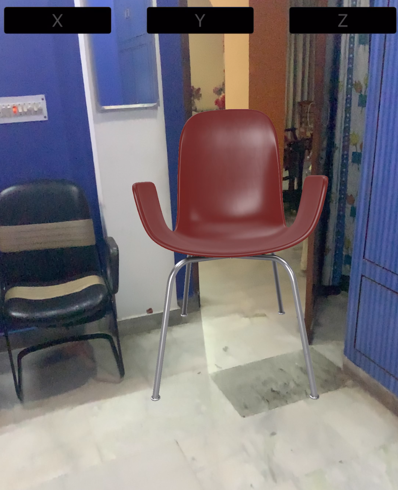
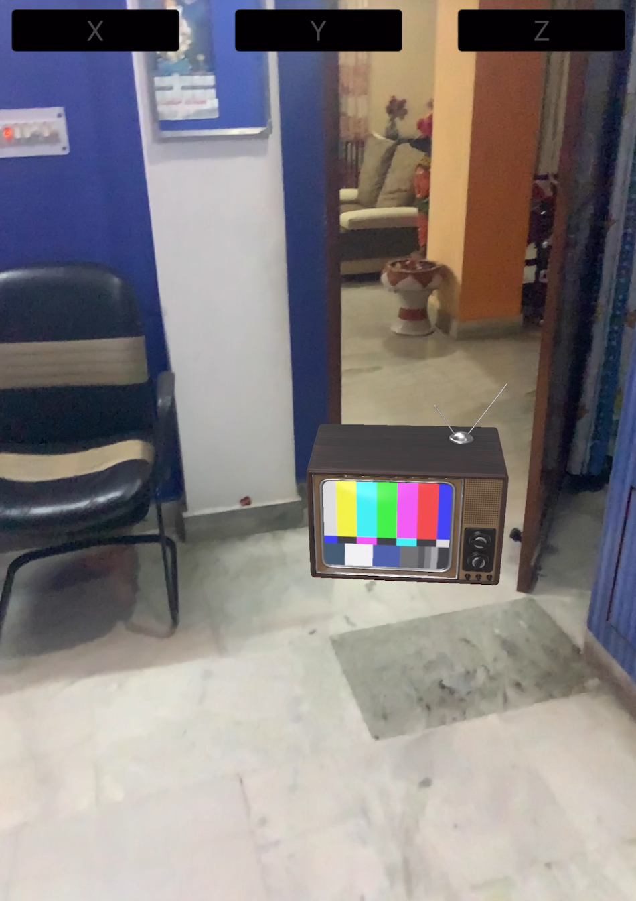
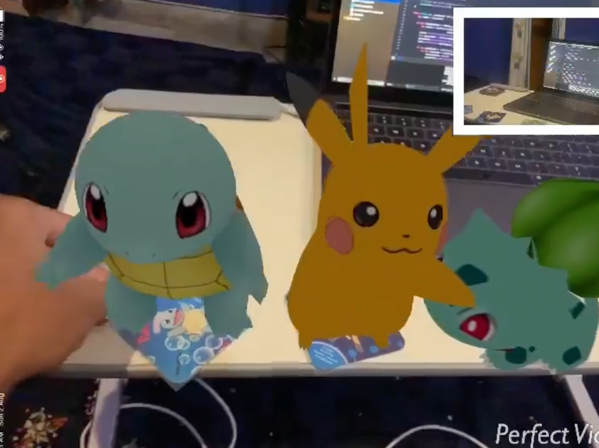
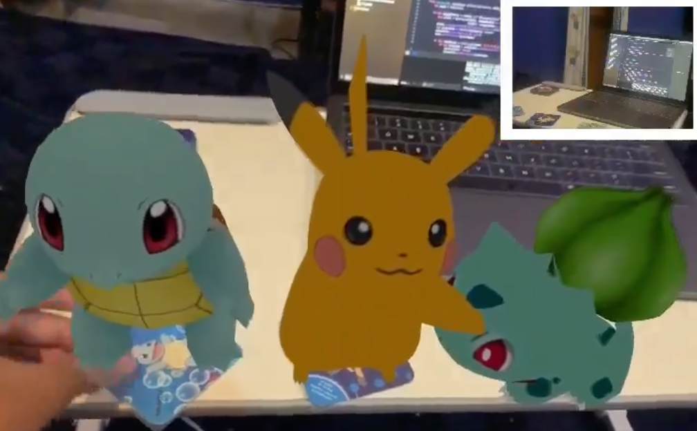
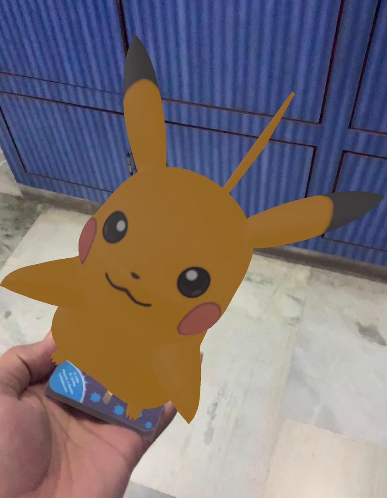

# Visionaries
 

<h2>About the app</h2>

 

<h2>Thought behind this Idea</h2>
 In The current shopping apps, customer often feels somewhat unfaithfull/uninterested in certain products because of the following reasons:-
  
 
 ▸ The size/appearance of the product may not suit well as per our requirements; for eg: furniture, equipments ,etc 
 ▸ Due to some of the low qualities photos we not be able to judge the material and texture of the product; for eg: clothes, etc 
 
 So what we aim at doing is providing a mean for the customer to experience the product in its own environment by augmented reality. 
 We also aim at making search for a product much easier using ML and image tracing 
 

 
<h2>About Project</h2>
Visionaries is a demo for the idea we are trying to convey.
There are three features mainly in this demo
 
 
• <b>Facial Recognition</b>
 
 
 
   
  This is a similar to the "face filter" we come across on snapchat and other platforms. 
  With this feature our thought was to convey a mean for a person to have a augmented reality based tryout of accessories like 
  spectacles,clothes,watches,rings, etc on their own body.
    
  
  
• <b>Sample Review</b>
 
 
   
  This is where a person can feel the presence of a product (say furniture , electronic apliances) in thier own surrounding. 
  With this feature our thought was to convey a mean for a person to have a augmented reality based experience of the shape,size,appearance
  of the product
    
  
  
• <b>Image Search</b>
 
  
   
  This is where a person can search for a product (say furniture , electronic apliances) through an image 
  With this feature our thought was to provide a way for the customers to search for a product through and image and experience it in their world
  
 
